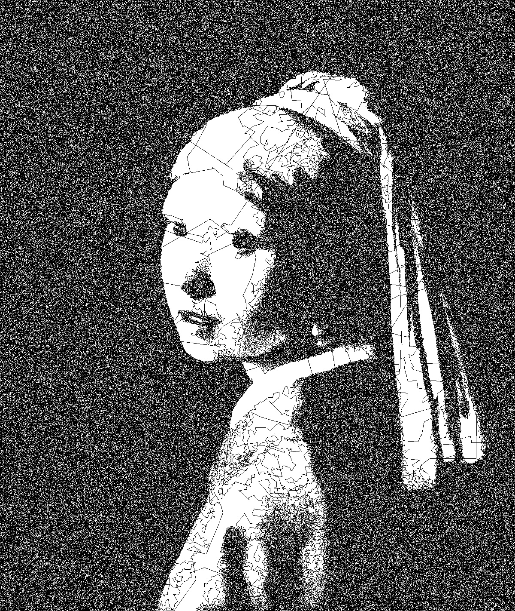
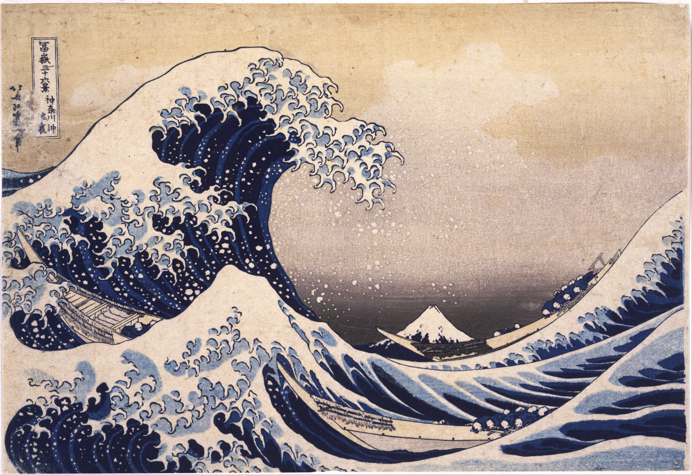
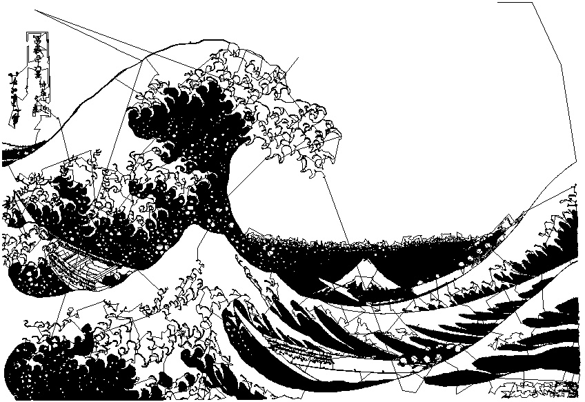

This project draws pitures in a single stroke like so:

<table align="center">
  <tr>
    <td align="center"></td>
    <td align="center" style="vertical-align: middle; font-size: 32px;">➡️</td>
    <td align="center"></td>
  </tr>
</table>

Or so:

<table align="center">
  <tr>
    <td align="center"></td>
    <td align="center" style="vertical-align: middle; font-size: 32px;">➡️</td>
    <td align="center"></td>
    <td align="center" style="vertical-align: middle; font-size: 32px;">➡️</td>
    <td align="center"></td>
  </tr>
</table>

